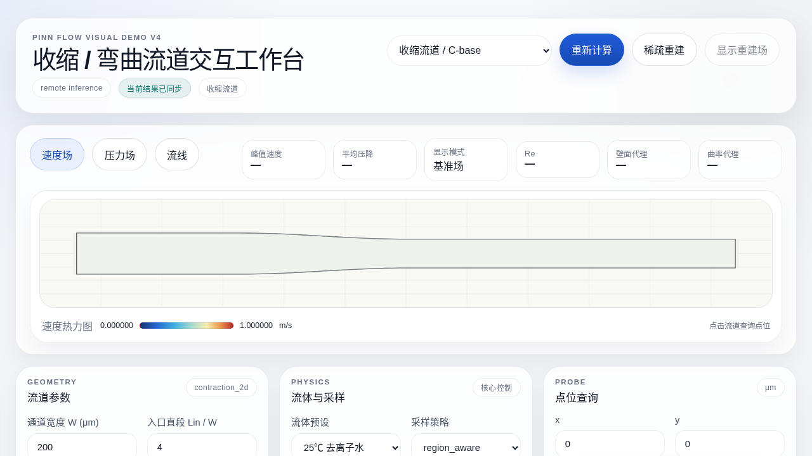
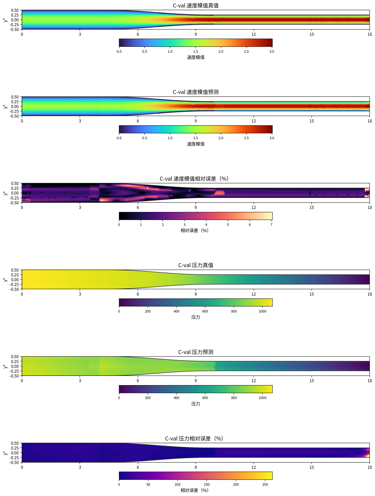
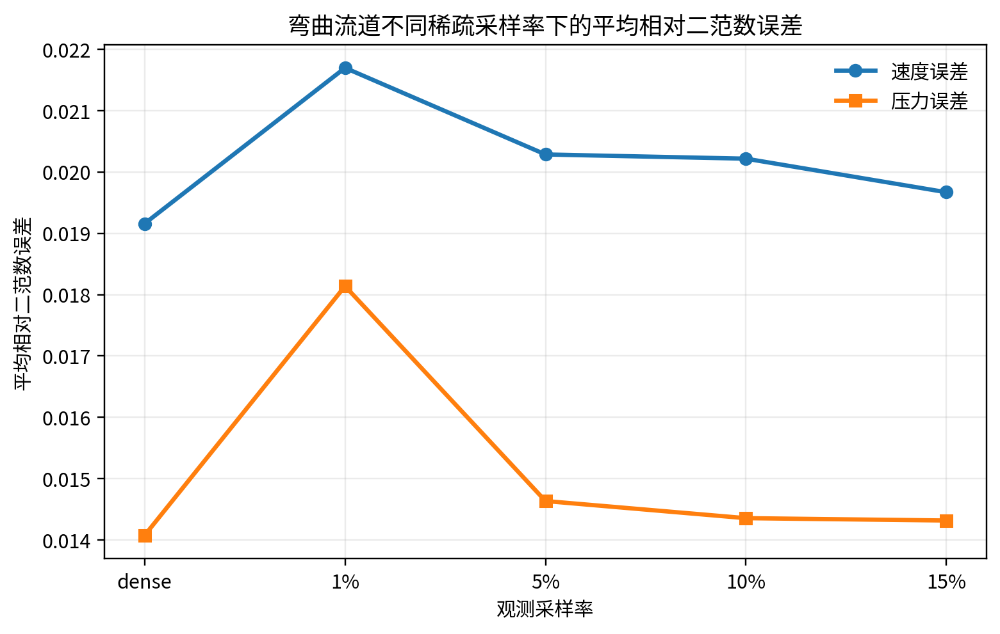
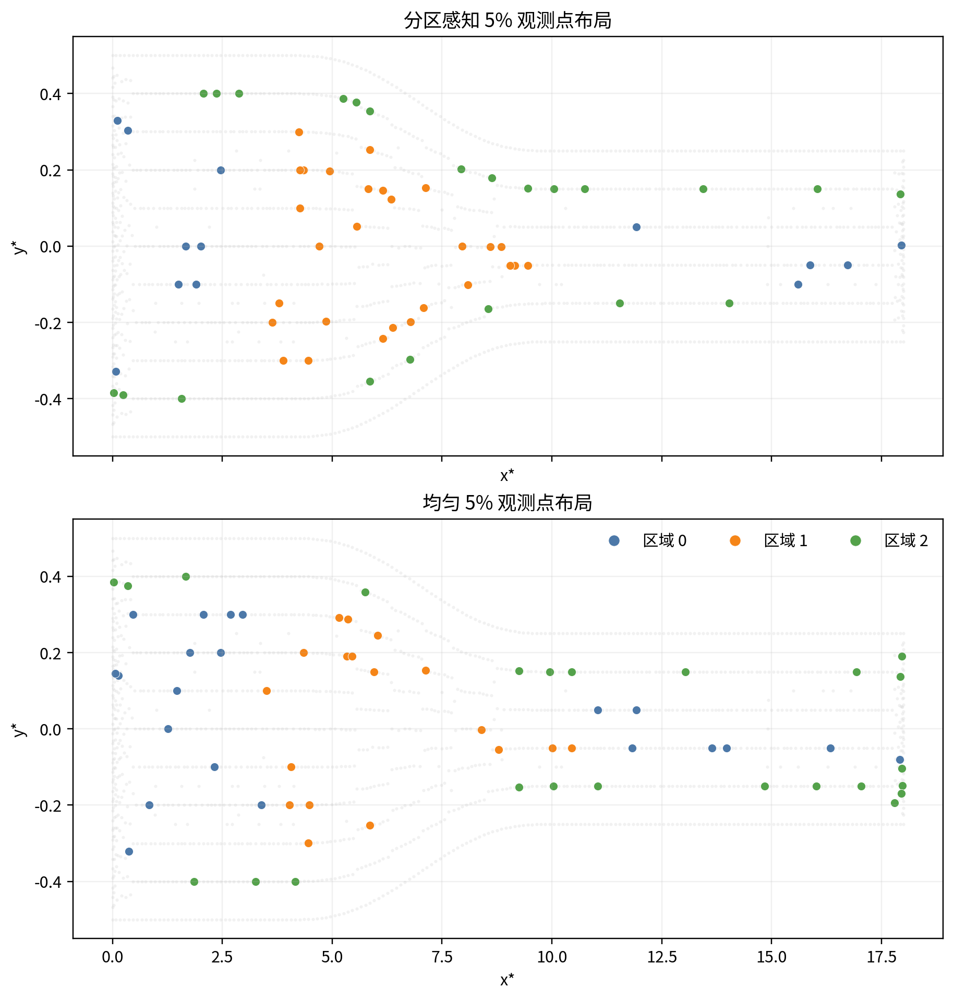

# pinn-platform-v4

`pinn-platform-v4` 是毕业设计“基于 PINN 的微流控芯片内二维稳态流场稀疏重建与可视化系统设计与实现”的单仓库正式版项目。仓库将原先分散的模型研究、后端接口、前端可视化、论文素材与关键实验结果整合为一个完整闭环，用于展示研究过程、系统实现与最终交付形态。

项目面向二维、定常、低雷诺数微流控内流问题，选取弯曲流道与收缩流道作为典型对象，围绕“少量观测点条件下的速度场与压力场重建”这一核心问题，打通了：

- 参数化几何建模与 CFD 真值准备
- 稀疏/含噪观测构造
- 基于 PDE 约束的 PINN 训练与评估
- 后端推理接口与网页可视化展示
- 论文图表、关键 run 与复现材料整理

在线演示：

- 页面：`https://aqsk.top/pinn-flow-visual-demo-v4/`
- API：`https://aqsk.top/api/pinn-v4/`

## 项目概览

- 研究对象：弯曲流道与收缩流道的二维稳态流场
- 研究目标：在稀疏、含噪观测条件下恢复速度场与压力场整体分布
- 方法主线：独立速度模型 + 独立压力模型 + 阶段内 PDE 约束 + 最终耦合修正
- 系统形态：`web + api + model + docs + results` 单仓库交付
- 展示资产：关键 checkpoint、评估结果、日志、导图检查与论文第五章素材已并入仓库

## 界面与结果示意

下图展示了当前整合仓中保留的系统界面与代表性结果。README 只放最核心的几张图，更多结果可在 [`model/results/`](./model/results) 和 [`docs/`](./docs) 中查看。



图 1 展示了在线可视化界面的整体形态。前端用于参数编辑、案例选择、流场热图显示与局部信息查询；后端统一组织几何参数、物理量与模型推理逻辑。

| 收缩流道重建示例 | 稀疏采样影响汇总 |
| --- | --- |
|  |  |

图 2 给出了收缩流道验证案例的速度场与压力场重建效果。图 3 总结了观测稀疏率变化对重建质量的影响，用于支撑论文中关于稀疏观测可行性的结论。



图 4 展示了区域感知采样与均匀采样的布局对比。该设计用于在相同观测预算下优先保留结构核心区、近壁区等关键流动信息。

## 研究问题与适用范围

微流控芯片设计阶段常常需要快速比较不同通道几何方案。传统 CFD 具有较高精度，但在频繁改参数、快速验证、结果展示与交互式分析场景下成本较高；同时，真实测量往往只能获得少量、带噪声的观测点。

本项目针对以下问题展开：

- 在少量观测点条件下，是否能够恢复速度场与压力场的整体结构
- 在轻度噪声扰动下，模型是否仍能保持稳定
- 重建结果是否能够直接服务于在线展示、参数对比与局部查询

当前适用范围主要是：

- 二维
- 定常
- 不可压缩
- 低雷诺数
- 参数化典型微通道

## 方法与系统实现

### 1. 参数化物理建模

项目统一采用二维、定常、不可压缩、低雷诺数流动设定，在无量纲框架下组织几何与场变量。控制方程以定常 Stokes 方程与连续性方程为基础，边界条件包括：

- 入口速度约束
- 壁面无滑移约束
- 出口压力参考约束

当前正式设置中，特征宽度取 `200 um`，入口平均速度取 `0.1 mm/s`，雷诺数远小于 `1`，符合黏性主导稳态内流的适用条件。

### 2. 双模型 PDE 耦合 PINN

项目没有采用单网络同时预测速度和压力，而是拆分为：

- 速度模型
- 压力模型

正式主线采用“先独立训练，再低学习率耦合修正”的组织方式。这样做的原因是速度与压力在尺度、训练难度和优化稳定性上并不完全一致，拆分后更容易控制训练过程，也更符合论文中的正式实验路线。

### 3. 统一数据链路

仓库中保留了两类流道的 case 数据与 CFD 原始导出结果，并在统一数据契约下组织：

- 稠密真值场
- 边界点
- 几何信息
- 元数据
- 多采样率稀疏观测
- 含噪观测

这样模型训练、离线评估、图像导出与网页展示都建立在同一套基础数据之上，便于复核与复现。

### 4. 在线系统整合

本仓库不是单纯的模型代码仓，而是完整的研究型系统交付：

- `web/`：React + Vite 前端，用于参数编辑、结果显示和在线交互
- `api/`：Python API，用于组织输入、调用模型、返回标准化结果
- `model/`：训练、评估、case 生成、导图与论文素材工作区
- `docs/`：整合、部署、复现与版本演进文档

当前前后端协作支持：

- 预设案例与参数化输入
- 流体参数与观测参数设置
- 速度场与压力场热图显示
- 流线图层切换
- 稀疏重建结果展示
- 任意点局部查询
- 若干派生指标显示，如 `Re`、峰值速度、平均压降等

## 主要结果

根据论文中的正式实验与分析，当前仓库对应的方法具有以下特点：

- 在给定参数范围内，可以较好恢复速度场和压力场的整体分布
- 在 `5%` 左右的稀疏观测条件下，已经能达到较有实用价值的重建效果
- 在 `3%` 级别轻度噪声扰动下，模型性能会退化，但整体流场模式与压降趋势仍能保持稳定
- 对未见几何工况具有一定泛化能力，但几何偏移过大时，尤其是压力场误差会明显上升
- 阶段内 PDE 约束对速度场提升有限，但对压力场质量与局部压力误差控制更有帮助

需要说明的是，本项目的目标并不是替代高精度 CFD，而是在微流控芯片设计早期提供一套兼顾物理一致性、推理速度、稀疏观测适应能力与可视化展示能力的快速验证方案。

## 当前保留的关键结果资产

当前整合仓对应的收缩流道正式主线 run 为：

- `contraction_independent_geometry_notemplate_stagepde_mainline_v4`

仓库中已保留以下展示资产：

- `model/results/pinn/` 下的主线与若干对照 run
- 对应 `best.ckpt`、`config.json`、`metrics.json`、`history.csv`
- 训练日志与评估日志
- `field_map_checks/` 下的误差导图与章节素材
- `thesis_assets/chapter5/` 下的第五章图片与 `manifest`

弯曲流道历史上对应的 run 名称仍然保留，但整合仓未并入全部 bend 权重；若本地缺少对应 checkpoint，API 会退回合成场 fallback，以保证网站仍可正常启动和演示。

## 仓库结构

```text
pinn-platform-v4/
├─ README.md
├─ .gitignore
├─ docs/
├─ web/
├─ api/
├─ model/
└─ legacy/
```

各目录职责如下：

- `web/`：前端源码、构建配置、测试与前端文档
- `api/`：统一 API 入口 [`api/pinn_platform_api.py`](./api/pinn_platform_api.py)
- `model/`：模型、数据、训练脚本、评估脚本与结果资产
- `docs/`：整合说明、部署说明、复现指南与版本演进文档
- `legacy/`：历史资源兼容说明，不作为正式主线的一部分

## 快速开始

### 0. 安装模型依赖

```bash
python3 -m venv .venv
source .venv/bin/activate
pip install --upgrade pip
pip install -r model/requirements.txt
```

### 1. 安装前端依赖

```bash
cd web
npm install
cd ..
```

### 2. 启动 API

```bash
python3 api/pinn_platform_api.py --host 127.0.0.1 --port 8011
```

### 3. 启动前端

```bash
cd web
npm run dev
```

### 4. 模型训练 / 评估

```bash
cd model
bash scripts/run_contraction_independent_mainline_lowimpact.sh
```

## 复现说明

本仓库已经支持较强的展示级复现与关键结果核验，具体可分为四个层级：

- 展示级复现：运行网站与 API，读取仓库中保留的 checkpoint 与结果
- 结果核验级复现：重新执行评估、导图与论文素材整理脚本
- 训练级复现：基于仓库中保留的 case 数据重新训练主线模型
- 全链路重建级复现：从几何与脚本出发重新生成 CFD 真值并再训练

更详细的依赖、命令与边界说明见：

- [`docs/REPRODUCTION_GUIDE.md`](./docs/REPRODUCTION_GUIDE.md)

## 适用范围与当前限制

本项目当前更适合以下场景：

- 二维
- 定常
- 低雷诺数
- 参数化典型微通道
- 少量观测点下的快速重建与可视化

当前限制主要包括：

- 对更复杂几何和更大参数范围的泛化能力仍有限
- 对真实实验级噪声与更复杂边界条件的适应性仍需继续验证
- 弯曲流道并未把全部历史权重都并入整合仓
- 仓库当前仅纳入用于展示的关键结果快照，不包含所有历史中间产物

## 相关文档

- 仓库结构说明：[`docs/REPO_LAYOUT.md`](./docs/REPO_LAYOUT.md)
- 整合与部署说明：[`docs/INTEGRATION_AND_DEPLOYMENT.md`](./docs/INTEGRATION_AND_DEPLOYMENT.md)
- 复现指南：[`docs/REPRODUCTION_GUIDE.md`](./docs/REPRODUCTION_GUIDE.md)
- 版本演进与试错时间线：[`docs/PROJECT_EVOLUTION_V1_TO_V4.md`](./docs/PROJECT_EVOLUTION_V1_TO_V4.md)
- 模型工作区说明：[`model/README.md`](./model/README.md)

## 说明

- 本仓库对应毕业论文中的正式整合版本，强调“研究链路 + 工程展示”一体化
- `web/docs/` 与 `model/docs/` 中保留了原子项目文档，因此部分历史描述仍会提到旧目录名
- 若后续需要继续面向答辩展示或开源整理，可在当前结构上进一步收敛首页、补充更多图示或增加英文说明
