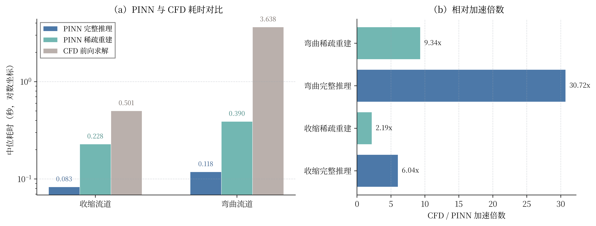
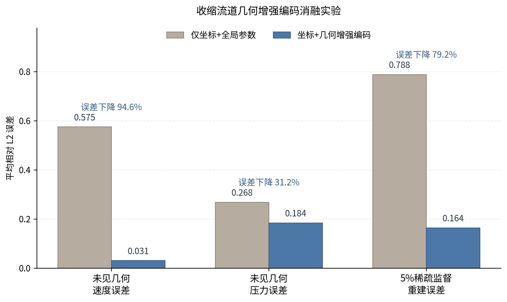
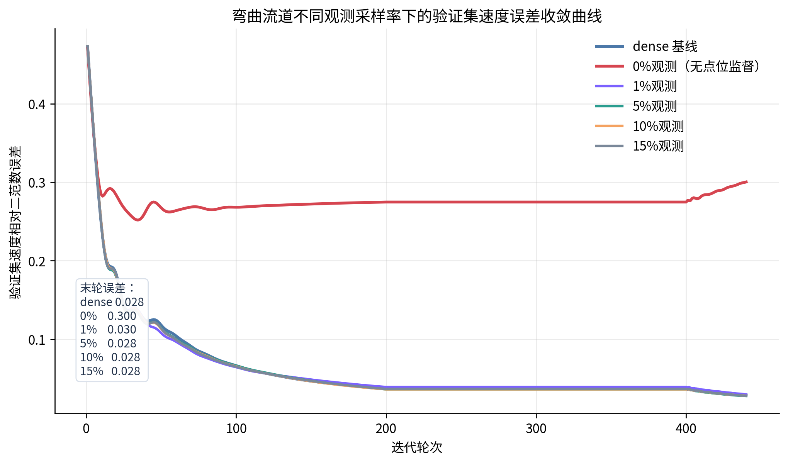

# pinn-platform-v4

<p align="center">
  <strong>基于 PINN 的微流控芯片内二维稳态流场稀疏重建与可视化系统</strong>
</p>

<p align="center">
  一个把 <strong>参数化几何建模</strong>、<strong>CFD 真值准备</strong>、<strong>双模型 PDE 耦合 PINN</strong>、<strong>在线反问题求解</strong> 和 <strong>网页交互展示</strong><br/>
  真正打通在同一仓库里的研究型项目。
</p>

<p align="center">
  <a href="./LICENSE"></a>
  
  
  
  
</p>

<p align="center">
  <a href="https://aqsk.top/pinn-flow-visual-demo-v4/">在线页面</a>
  ·
  <a href="https://aqsk.top/api/pinn-v4/">在线 API</a>
  ·
  <a href="./docs/REPRODUCTION_GUIDE.md">复现指南</a>
  ·
  <a href="./docs/PROJECT_EVOLUTION_V1_TO_V4.md">项目演进记录</a>
</p>


## 项目一眼看懂

这不是一个“只放训练脚本”的模型仓库。

它对应毕业设计《基于 PINN 的微流控芯片内二维稳态流场稀疏重建与可视化系统设计与实现》的正式整合版，把原先分散的模型研究、后端接口、前端工作台、论文图表和关键实验结果收束成了一个完整闭环：

- 从参数化流道几何出发生成 CFD 真值
- 构造 `1% / 5% / 10% / 15%` 稀疏观测与含噪观测
- 用双模型 PDE 耦合 PINN 同时恢复速度场和压力场
- 在网页中完成完整场推理、稀疏重建、差异场显示和点位查询
- 将关键 run、误差图、消融实验和 benchmark 直接留档在仓库里

如果第一次看到这个项目，最值得记住的是：

- 原来 PINN 不一定要一个网络同时预测 `u,v,p`，速度和压力可以拆开训练，再通过 PDE 残差做交替耦合。
- 原来“几何编码”不是点缀，它对未见几何泛化和稀疏重建都能带来很大的真实改善。
- 原来在线反问题求解不只是学术图，而是已经接进了一个可交互、可查询、可演示的页面系统。
- 原来在当前预览分辨率下，PINN 在线推理和稀疏重建相对同机 CFD 已经有明确速度优势。

## 最重要的结果

| 结论 | 结果 |
| --- | ---: |
| 弯曲流道完整推理相对 CFD 加速 | `30.72x` |
| 弯曲流道稀疏重建相对 CFD 加速 | `9.34x` |
| 收缩流道未见几何速度误差下降 | `94.64%` |
| 收缩流道 5% 稀疏监督重建误差下降 | `79.16%` |
| 弯曲流道 5% 观测速度误差相对 dense | `0.98x` |
| 弯曲流道 0% 观测速度误差相对 dense | `10.69x` |

这些数字分别来自：

- [`docs/benchmarks/pinn_vs_cfd_speed_benchmark_20260420.md`](./docs/benchmarks/pinn_vs_cfd_speed_benchmark_20260420.md)
- [`docs/ablations/geometry_encoding_ablation_20260420/geometry_encoding_ablation_summary.md`](./docs/ablations/geometry_encoding_ablation_20260420/geometry_encoding_ablation_summary.md)
- [`docs/ablations/bend_zero_supervision_20260420/bend_zero_supervision_summary.md`](./docs/ablations/bend_zero_supervision_20260420/bend_zero_supervision_summary.md)

## 为什么这个项目值得看

### 1. 双模型 PDE 耦合 PINN

项目没有采用单网络同时输出速度和压力，而是拆成：

- 速度模型：预测 `u,v`
- 压力模型：预测 `p`

训练流程是：

1. 先独立训练速度模型
2. 再独立训练压力模型
3. 最后用连续性残差和动量残差做低学习率交替耦合

这条主线不是概念描述，而是当前正式训练脚本的真实实现，见：

- [`model/scripts/train_velocity_pressure_independent.py`](./model/scripts/train_velocity_pressure_independent.py)

这带来的好处很直接：

- 速度和压力的尺度差异不再互相拖累
- 训练过程更稳定
- PDE 约束能够在最终耦合阶段把两个模型重新拉回同一个物理系统

### 2. 几何增强编码不是装饰，而是关键增益来源

项目做了严格的消融对比：

- 对比 A：仅坐标 + 全局参数
- 对比 B：坐标 + 几何增强编码

在收缩流道上，几何增强编码带来的改进非常明显：

- 未见几何速度误差从 `0.5753` 降到 `0.0308`
- 压力误差从 `0.2681` 降到 `0.1843`
- 5% 稀疏监督重建误差从 `0.7883` 降到 `0.1643`

也就是说，这个项目里“几何编码”不是为了好听，而是真正决定模型是否能跨几何外推、能否靠少量观测点恢复全场的核心设计。

### 3. 稀疏重建是在线反问题求解，不是静态贴图

系统中的“稀疏重建”按钮不是简单换一张图，而是：

- 先只给模型少量稀疏观测点
- 再恢复完整流场
- 然后与完整计算结果做同屏对比
- 还可以切到“差异场”直接看速度差和压差

这意味着仓库不仅有离线训练和论文图表，也已经把“在线反问题求解”落实为一个可以演示、可查询、可对比的交互链路。

### 4. 这是一个真正可交付的研究系统，而不是零散实验堆积

仓库中同时保留了：

- `web/`：前端工作台
- `api/`：统一推理接口
- `model/`：训练、评估、导图与 benchmark
- `docs/`：复现、部署、演进和章节素材

因此它能同时回答四类问题：

- 模型怎么训练
- 结果到底好不好
- 能不能在线演示
- 结论能不能写进论文和复现文档

## 代表性结果图

### 在线工作台与场重建

| 在线页面 | 收缩流道重建效果 |
| --- | --- |
|  |  |

左图是当前网页工作台，支持案例预设、流道参数修改、流体参数设置、稀疏观测设置、完整场/重建场/差异场切换以及点位查询。  
右图展示了收缩流道验证案例下的速度场、压力场及误差分布结果。

### PINN 相对 CFD 的推理速度优势



在当前预览分辨率下，同机 benchmark 的中位耗时结果为：

- 收缩流道完整推理：PINN `0.083 s`，CFD `0.501 s`，加速 `6.04x`
- 收缩流道稀疏重建：PINN `0.228 s`，CFD `0.501 s`，加速 `2.19x`
- 弯曲流道完整推理：PINN `0.118 s`，CFD `3.638 s`，加速 `30.72x`
- 弯曲流道稀疏重建：PINN `0.390 s`，CFD `3.638 s`，加速 `9.34x`

这说明本项目的目标不是替代高精度 CFD，而是在参数探索、在线展示和设计早期快速验证场景中，提供更轻量、更快的可用解。

### 几何增强编码消融



这张图非常关键。它说明：

- 模型不是“背熟了训练工况”，而是在几何表达上真的更强了
- 几何增强编码不仅改善了未见几何速度外推，也显著改善了稀疏监督下的全场重建

如果要概括这部分创新点，可以直接说：

> 在这个项目里，几何编码不只是输入增强，而是决定几何泛化能力和稀疏重建能力的核心机制。

### 稀疏观测到底有没有用



这张图回答了一个很重要的问题：少量观测点到底是不是“可有可无”。

答案很清楚：

- `1% / 5% / 10% / 15%` 观测的最终误差都和 dense 很接近
- `5%` 观测下弯曲流道速度误差是 `0.0275`，几乎与 dense 的 `0.0281` 持平
- 一旦变成 `0%观测`，误差会恶化到 `0.3004`，相对 dense 约 `10.69x`

这说明“稀疏观测 + 物理约束”是有效路线，但“完全没有内部观测点”在当前设置下并不够。

## 当前最能代表项目价值的创新点

如果只保留最硬、最不凑数的创新点，我会这样概括：

1. **双模型 PDE 耦合 PINN 主线**  
   将速度和压力拆成两个模型独立训练，再通过连续性和动量残差交替耦合，兼顾训练稳定性和物理一致性。

2. **面向参数化微流道的几何增强编码**  
   它对未见几何外推和 5% 稀疏监督全场恢复都带来了显著、可量化的增益。

3. **面向在线演示的稀疏重建与差异场展示链路**  
   不是离线图，而是已经接入前后端工作台，可以直接做完整场、重建场、差异场和点位查询。

4. **研究闭环与工程闭环合一的单仓库交付**  
   从 CFD 真值、训练、评估、导图、benchmark 到网页展示和论文素材，全链路都留在同一仓库中，便于复核和复现。

## 仓库结构

```text
pinn-platform-v4/
├─ README.md
├─ LICENSE
├─ docs/
├─ web/
├─ api/
├─ model/
└─ legacy/
```

各目录职责如下：

- `web/`：React + Vite 前端工作台
- `api/`：统一 API 入口 [`api/pinn_platform_api.py`](./api/pinn_platform_api.py)
- `model/`：模型、数据、训练脚本、评估脚本和结果资产
- `docs/`：复现、部署、benchmark、演进记录和论文素材
- `legacy/`：历史资源兼容说明，不作为正式主线

## 快速开始

### 1. 安装模型依赖

```bash
python3 -m venv .venv
source .venv/bin/activate
pip install --upgrade pip
pip install -r model/requirements.txt
```

### 2. 安装前端依赖

```bash
cd web
npm install
cd ..
```

### 3. 启动 API

```bash
python3 api/pinn_platform_api.py --host 127.0.0.1 --port 8011
```

### 4. 启动前端

```bash
cd web
npm run dev
```

### 5. 训练主线模型

```bash
cd model
bash scripts/run_contraction_independent_mainline_lowimpact.sh
```

## 复现与延伸阅读

- 复现指南：[`docs/REPRODUCTION_GUIDE.md`](./docs/REPRODUCTION_GUIDE.md)
- 仓库结构说明：[`docs/REPO_LAYOUT.md`](./docs/REPO_LAYOUT.md)
- 整合与部署说明：[`docs/INTEGRATION_AND_DEPLOYMENT.md`](./docs/INTEGRATION_AND_DEPLOYMENT.md)
- 项目演进与试错时间线：[`docs/PROJECT_EVOLUTION_V1_TO_V4.md`](./docs/PROJECT_EVOLUTION_V1_TO_V4.md)
- 模型工作区说明：[`model/README.md`](./model/README.md)

## 开源许可

本项目采用 **MIT License** 开源。

你可以在保留原许可声明的前提下：

- 学习和复用代码
- 修改并再发布
- 将其中的训练、评估或展示模块集成进你自己的项目

详见 [`LICENSE`](./LICENSE)。

## 说明

- 本仓库强调“研究链路 + 工程展示”一体化
- 当前适用范围主要是二维、定常、低雷诺数、参数化典型微通道
- 目标不是替代高精度 CFD，而是提供更快的设计验证与稀疏重建方案
- 更多图片、run、日志和章节素材可在 [`model/results/`](./model/results) 与 [`docs/`](./docs) 中查看
