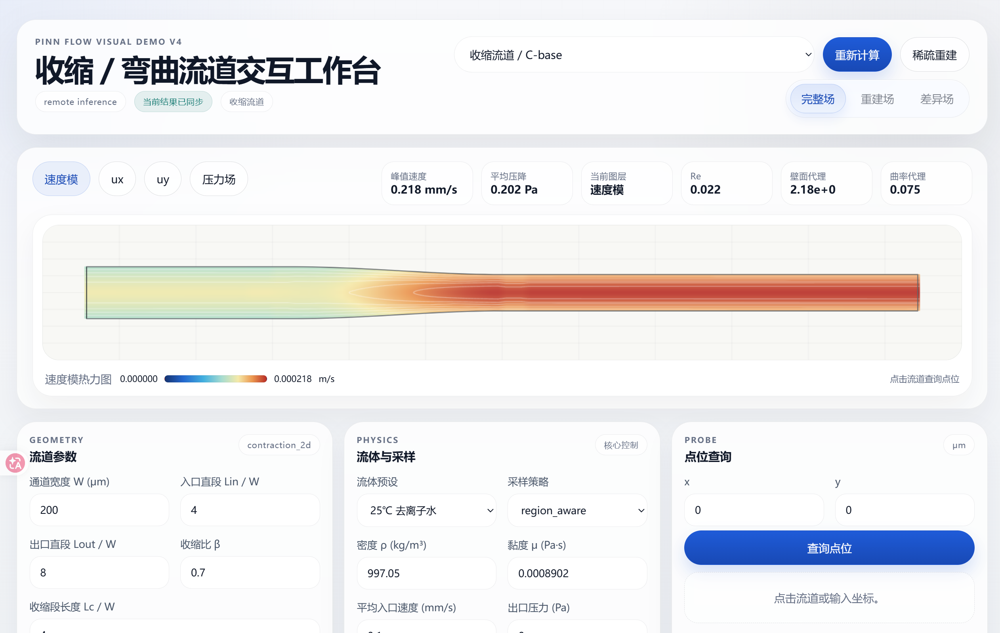
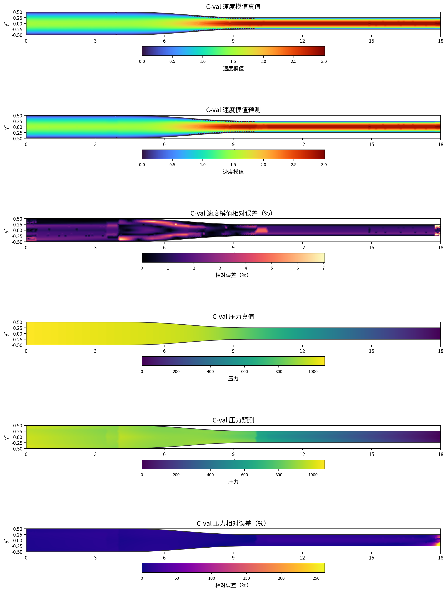
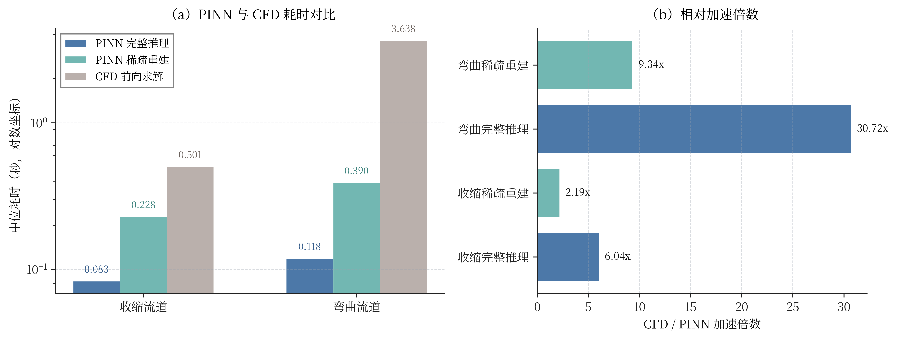
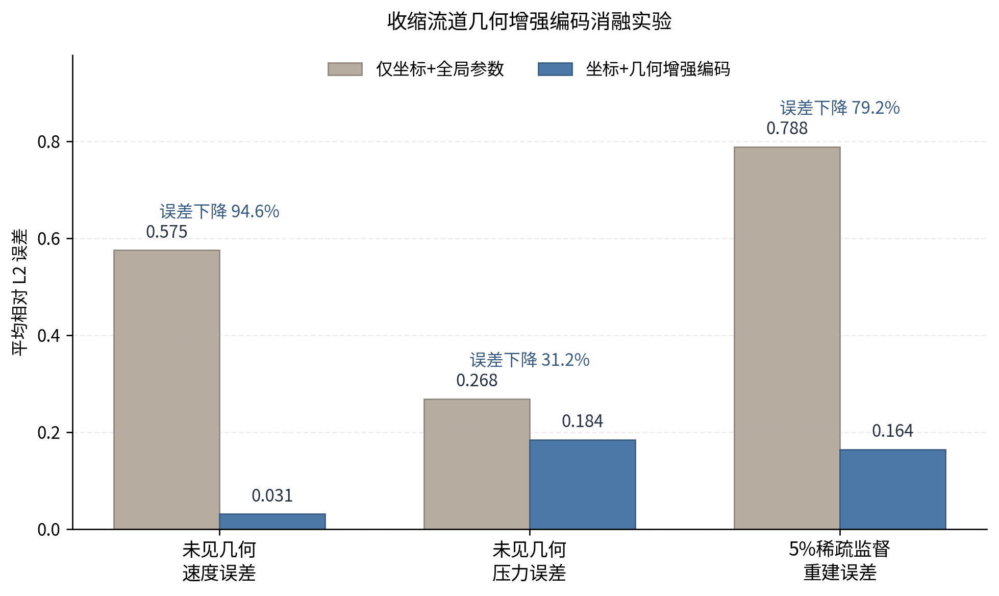
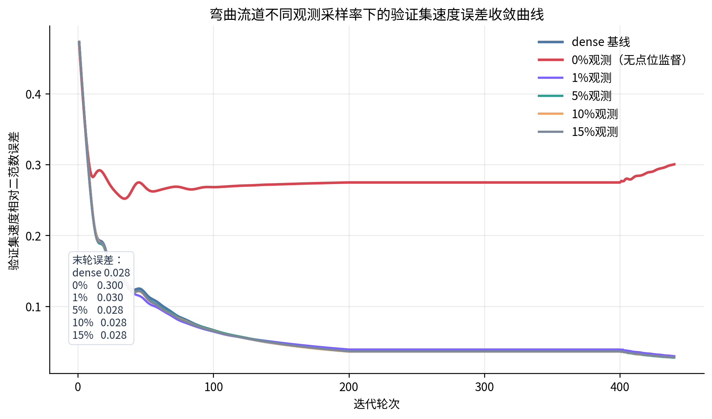

# pinn-platform-v4

<p align="center">
  <strong>基于 PINN 的微流控芯片内二维稳态流场稀疏重建与可视化系统</strong>
</p>

<p align="center">
  参数化几何建模 → CFD 真值准备 → 双模型 PDE 耦合 PINN → 在线反问题求解 → 网页交互展示<br/>
  全链路在同一仓库内闭环。
</p>

<p align="center">
  <a href="./LICENSE"></a>
  
  
  
  
</p>

<p align="center">
  <a href="https://aqsk.top/pinn-flow-visual-demo-v4/">在线页面</a>
  ·
  <a href="https://aqsk.top/api/pinn-v4/">在线 API</a>
  ·
  <a href="./docs/REPRODUCTION_GUIDE.md">复现指南</a>
  ·
  <a href="./docs/PROJECT_EVOLUTION_V1_TO_V4.md">项目演进记录</a>
</p>



## 这是什么

对应毕业设计《基于 PINN 的微流控芯片内二维稳态流场稀疏重建与可视化系统设计与实现》的整合仓库。它不只是一个模型训练脚本集——从参数化流道几何生真值，到构造稀疏/含噪观测，到双模型 PDE 耦合训练，到网页端完成场推理、稀疏重建和差异场对比，全部在同一仓库里可跑、可查、可复现。

如果你第一次看这个项目，记住这几件事就够了：

- 速度和压力拆成两个模型各自训练，再通过 PDE 残差交替耦合。不需要一个网络同时扛 `u,v,p`。
- 几何编码在这里不是锦上添花，它对未见几何泛化和稀疏重建都有量化的增益。
- 在线反问题求解不只是论文里的概念图，而是已经接进了可交互的页面系统。
- 在预览分辨率下，PINN 推理相对同机 CFD 有明确的速度优势。

## 核心结果

| 结论 | 结果 |
| --- | ---: |
| 弯曲流道完整推理相对 CFD 加速 | `30.72x` |
| 弯曲流道稀疏重建相对 CFD 加速 | `9.34x` |
| 收缩流道未见几何速度误差下降 | `94.64%` |
| 收缩流道 5% 稀疏监督重建误差下降 | `79.16%` |
| 弯曲流道 5% 观测速度误差相对 dense | `0.98x` |
| 弯曲流道 0% 观测速度误差相对 dense | `10.69x` |

数字来源：

- [`docs/benchmarks/pinn_vs_cfd_speed_benchmark_20260420.md`](./docs/benchmarks/pinn_vs_cfd_speed_benchmark_20260420.md)
- [`docs/ablations/geometry_encoding_ablation_20260420/geometry_encoding_ablation_summary.md`](./docs/ablations/geometry_encoding_ablation_20260420/geometry_encoding_ablation_summary.md)
- [`docs/ablations/bend_zero_supervision_20260420/bend_zero_supervision_summary.md`](./docs/ablations/bend_zero_supervision_20260420/bend_zero_supervision_summary.md)

## 关键设计

### 1. 双模型 PDE 耦合

不是单网络同时输出 `u,v,p`，而是：

- 速度模型预测 `u,v`
- 压力模型预测 `p`

训练流程：先各独立训练，再用连续性残差和动量残差以低学习率交替耦合。训练脚本见 [`model/scripts/train_velocity_pressure_independent.py`](./model/scripts/train_velocity_pressure_independent.py)。

这样做的好处很实际：速度和压力的尺度差异不再互相拖累，训练过程更稳，PDE 约束在最后耦合阶段把两个模型拉回同一物理系统。

### 2. 几何增强编码

我们做了严格的消融对比——仅坐标 + 全局参数 vs. 坐标 + 几何增强编码。在收缩流道上：

- 未见几何速度误差从 `0.5753` 降到 `0.0308`
- 压力误差从 `0.2681` 降到 `0.1843`
- 5% 稀疏监督重建误差从 `0.7883` 降到 `0.1643`

几何编码在这里是决定模型能否跨几何外推、能否靠少量观测点恢复全场的核心机制，不是装饰。

### 3. 稀疏重建 = 在线反问题求解

页面上的"稀疏重建"按钮在做的事：只给模型少量观测点 → 恢复完整流场 → 与完整计算结果同屏对比 → 可切到"差异场"看速度差和压差。

这不是静态贴图，是真正的在线反问题求解链路。

### 4. 单仓库全链路交付

仓库同时保留了 `web/`（前端工作台）、`api/`（统一推理接口）、`model/`（训练评估导图 benchmark）、`docs/`（复现部署演进素材）。它同时回答四个问题：模型怎么训、结果好不好、能不能在线演示、结论能不能写进论文。

## 代表性结果图

| 在线页面 | 收缩流道重建效果 |
| --- | --- |
|  |  |

左：当前网页工作台，支持案例预设、流道参数修改、流体参数设置、稀疏观测设置、完整场/重建场/差异场切换及点位查询。右：收缩流道验证案例下的速度场、压力场及误差分布。

### PINN vs CFD 推理速度



同机 benchmark 中位耗时：

- 收缩流道完整推理：PINN `0.083 s`，CFD `0.501 s`，加速 `6.04x`
- 收缩流道稀疏重建：PINN `0.228 s`，CFD `0.501 s`，加速 `2.19x`
- 弯曲流道完整推理：PINN `0.118 s`，CFD `3.638 s`，加速 `30.72x`
- 弯曲流道稀疏重建：PINN `0.390 s`，CFD `3.638 s`，加速 `9.34x`

目标不是替代高精度 CFD，而是在参数探索、在线展示和设计早期快速验证中提供更轻量的可用解。

### 几何增强编码消融



这张图很关键——它说明模型不是"背熟了训练工况"，而是在几何表达上真的更强了。几何增强编码同时改善了未见几何的速度外推和稀疏监督下的全场重建。

### 稀疏观测到底有没有用



- `1% / 5% / 10% / 15%` 观测的最终误差都和 dense 接近
- `5%` 观测下弯曲流道速度误差 `0.0275`，几乎与 dense 的 `0.0281` 持平
- 一旦变成 `0%` 观测，误差恶化到 `0.3004`，相对 dense 约 `10.69x`

也就是说，"稀疏观测 + 物理约束"是有效的路线，但完全没有任何内部观测点在当前设置下不够。

## 仓库结构

```text
pinn-platform-v4/
├─ README.md
├─ LICENSE
├─ docs/
├─ web/
├─ api/
├─ model/
└─ legacy/
```

- `web/`：React + Vite 前端工作台
- `api/`：统一 API 入口 [`api/pinn_platform_api.py`](./api/pinn_platform_api.py)
- `model/`：模型、数据、训练脚本、评估脚本和结果资产
- `docs/`：复现、部署、benchmark、演进记录和论文素材
- `legacy/`：历史资源兼容说明

## 快速开始

### 1. 安装模型依赖

```bash
python3 -m venv .venv
source .venv/bin/activate
pip install --upgrade pip
pip install -r model/requirements.txt
```

### 2. 安装前端依赖

```bash
cd web
npm install
cd ..
```

### 3. 启动 API

```bash
python3 api/pinn_platform_api.py --host 127.0.0.1 --port 8011
```

### 4. 启动前端

```bash
cd web
npm run dev
```

### 5. 训练主线模型

```bash
cd model
bash scripts/run_contraction_independent_mainline_lowimpact.sh
```

## 延伸阅读

- 复现指南：[`docs/REPRODUCTION_GUIDE.md`](./docs/REPRODUCTION_GUIDE.md)
- 仓库结构说明：[`docs/REPO_LAYOUT.md`](./docs/REPO_LAYOUT.md)
- 整合与部署说明：[`docs/INTEGRATION_AND_DEPLOYMENT.md`](./docs/INTEGRATION_AND_DEPLOYMENT.md)
- 项目演进与试错时间线：[`docs/PROJECT_EVOLUTION_V1_TO_V4.md`](./docs/PROJECT_EVOLUTION_V1_TO_V4.md)
- 模型工作区说明：[`model/README.md`](./model/README.md)

## 许可

本项目采用 **MIT License** 开源。你可以在保留原许可声明的前提下自由学习和复用它。详见 [`LICENSE`](./LICENSE)。

## 说明

- 适用于二维、定常、低雷诺数、参数化典型微通道
- 目标不是替代高精度 CFD，而是提供更快的设计验证与稀疏重建方案
- 更多图片、run、日志和章节素材见 [`model/results/`](./model/results) 与 [`docs/`](./docs)
